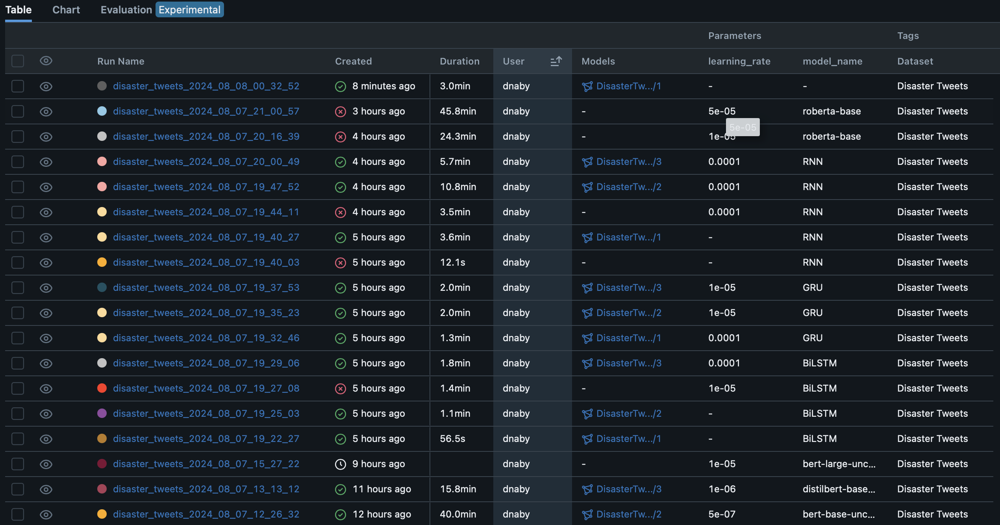

# NLP-Disaster-Tweets-Detection

## Project Overview

This project aims to detect disaster-related tweets using Natural Language Processing (NLP) techniques. The goal is to classify tweets into two categories: disaster-related and non-disaster-related.

## Dataset

The dataset used for this project is sourced from Kaggle and contains tweets labeled as either disaster-related or not. The dataset is split into training and testing sets to evaluate the performance of various models.

## Dataset Preview

Here is a preview of the dataset:

| id | keyword | location | text | target |
|----|---------|----------|------|--------|
| 1  |         |          | Our Deeds are the Reason of this #earthquake May ALLAH Forgive us all | 1 |
| 4  |         |          | Forest fire near La Ronge Sask. Canada | 1 |
| 5  |         |          | All residents asked to 'shelter in place' are being notified by officers. No other evacuation or shelter in place orders are expected | 1 |
| 6  |         |          | 13,000 people receive #wildfires evacuation orders in California | 1 |

## Exploratory Data Analysis (EDA)

Please click on this link to visualize the notebook with the different schemas for the EDA part on Colab: [EDA Notebook](https://drive.google.com/file/d/1MC0pyW-x7OVeTMwYqDDIkS6SGv29bL0F/view?usp=sharing)

### Noisy Word Cloud

Before preprocessing the tweets, a noisy word cloud is generated to visualize the most common words in the raw dataset. This helps in understanding the initial state of the data and identifying any noise or irrelevant information.


### Cleaned Word Cloud

After preprocessing the tweets, a cleaned word cloud is generated to visualize the most common words in the processed dataset. This helps in understanding the key terms and phrases that are relevant to disaster-related tweets.


### Best Models

The best models we obtained were with BiLSTM and BERT. These models were less prone to overfitting and provided better generalization on unseen data.

1. **BiLSTM (Bidirectional Long Short-Term Memory)**:
   - BiLSTM is a type of recurrent neural network (RNN) that can capture dependencies from both past and future contexts in the text data.
   - It performed well in capturing the sequential nature of the tweets and understanding the context, leading to better classification results.

### Classification Report

The following table shows the classification report for the best model, including precision, recall, f1-score, and support for each class:

  | Class | Precision | Recall | F1-Score | Support |
  |-------|-----------|--------|----------|---------|
  | 0     | 0.8074    | 0.8670 | 0.8362   | 880     |
  | 1     | 0.7976    | 0.7170 | 0.7551   | 643     |
  | **Accuracy** |       |        | 0.8037   | 1523    |
  | **Macro Avg** | 0.8025    | 0.7920 | 0.7956   | 1523    |
  | **Weighted Avg** | 0.8033    | 0.8037 | 0.8019   | 1523    |

  

  

2. **BERT (Bidirectional Encoder Representations from Transformers)**:
   - BERT is a transformer-based model that has achieved state-of-the-art results in various NLP tasks.
   - It leverages the power of transformers to understand the context of words in a sentence, making it highly effective for text classification tasks.
   - BERT's pre-trained nature and fine-tuning capabilities allowed it to excel in detecting disaster-related tweets with high accuracy.

### Classification Report

  The following table shows the classification report for the BERT model, including precision, recall, f1-score, and support for each class:

  | Class | Precision | Recall | F1-Score | Support |
  |-------|-----------|--------|----------|---------|
  | 0     | 0.8333    | 0.8182 | 0.8257   | 880     |
  | 1     | 0.7572    | 0.7760 | 0.7665   | 643     |
  | **Accuracy** |       |        | 0.8004   | 1523    |
  | **Macro Avg** | 0.7953    | 0.7971 | 0.7961   | 1523    |
  | **Weighted Avg** | 0.8012    | 0.8004 | 0.8007   | 1523    |

  

  

## MLFlow

MLFlow is used to track experiments, log model parameters, and store model artifacts. It helps in managing the lifecycle of machine learning models and provides a user-friendly interface to compare different runs.



## Tests

To ensure that the preprocessing functions are working correctly and to verify the integrity of the dataset, we have implemented a series of tests. The following image shows the successful execution of these tests:


Tests for the models will be implemented next.

## API

To test the API, we used the following input text: "hear earthquake different city stay safe everyone". The API returned a probability of 0.6727393865585327, indicating that it is classified as a disaster tweet.

Here is an example of the API response:


## Running the API

To run the API, navigate to the `./api` folder and execute the following command:
```cmd
cd api
uvicorn app:app --reload
```

## Run Code

To run all the notebooks, move to the folder `NLP-Disaster-Tweets-Detection` and install all the requirements inside your conda environment using the following commands:
```cmd
cd NLP-Disaster-Tweets-Detection
uvicorn app:app --reload
pip install -r requirements.txt
```

## Contributors

This work has been done by Kikia DIA, Mouhamadou Naby DIA et Ndeye Awa SALANE. 